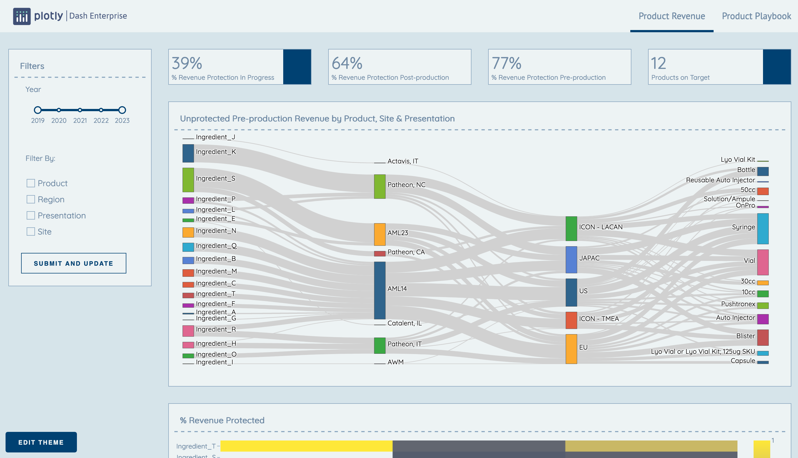
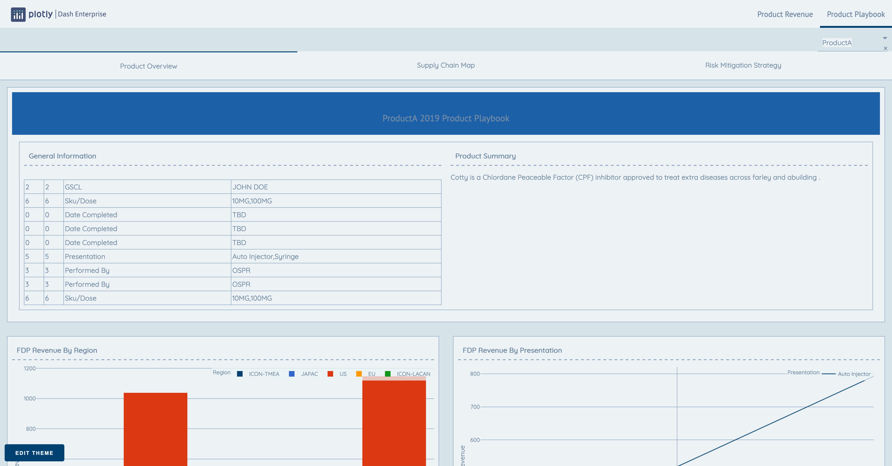

## Product Playbook
A full-fledged application illustrating the depth of capabailities of a Dash app: Nested tabs, a multitude of visuals, dynamic filtering, location data, and tabular data. The app allows a user to drill into information about a set of products and learn more about the location, presentation, and site for those products and interact with that information using several graphing styles.

The app also includes a "product playbook", which shows overview data and textual information about each individual product, broken down into several unique sections.

View this app on [Dash Deployment Server](https://dash-gallery.plotly.com/apps).

## Screenshots



## How to run this app
Clone this repository and create a virtual environment to run this app locally:

```
cd teaser-product-playbook
python3 -m virtualenv venv
```
In a Unix System:
```
source venv/bin/activate
```

In Windows: 

```
venv\Scripts\activate
```

Install all required Python dependencies by running:
```
pip install -r requirements.txt
```

Run this app with

```
python index.py
```

## Built with
- [Dash](https://dash.plot.ly/) - Main server and interactive python framework
- [Plotly](https://plot.ly/python/) - Used to create the interactive plots
- [Dash Design Kit](https://dash-design-kit.plot.ly/) - Professional, enterprise-ready styling for Dash apps 

